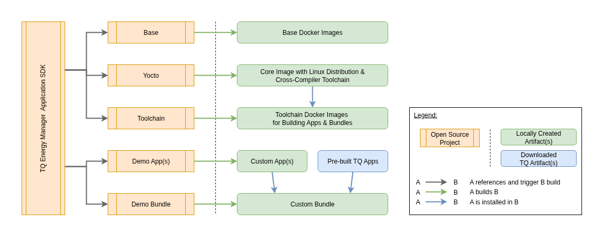

Overview
--------

List of main components
~~~~~~~~~~~~~~~~~~~~~~~

The following table lists all the main components of the App SDK.
The projects have a link to the source code.

.. list-table:: Main App SDK Components
   :header-rows: 1
   :widths: 25 75

   * - Project
     - Description
   * - `Base <https://github.com/tq-systems/em-build-base>`_
     - Creates Docker images, which serve as the basis for other Docker images
       in the TQ Energy Manager project.
   * - `Yocto <https://github.com/tq-systems/em-build-yocto>`_
     - Processes Builds of a customized Yocto-Based Linux distribution,
       optimized for the TQ Energy Manager.
   * - `Toolchain <https://github.com/tq-systems/em-build-toolchain>`_
     - Creates Docker images that are used to build and test artifacts for the TQ Energy Manager.
       These are mainly apps and bundles, but can also be tools, libraries or third-party software.
   * - `Demo Application <https://github.com/tq-systems/em-app-go-demo>`_
     - A simple Go-based reference implementation showcasing common patterns and best practices
       for TQ Energy Manager application.
   * - `Demo Bundle <https://github.com/tq-systems/em-bundle-demo>`_
     - A reference implementation for an TQ Energy Manager firmware.

Principal component dependencies
~~~~~~~~~~~~~~~~~~~~~~~~~~~~~~~~

The following image shows the essential relationships between the main components:

   Principal component dependencies

This also determines the assembly sequence.
